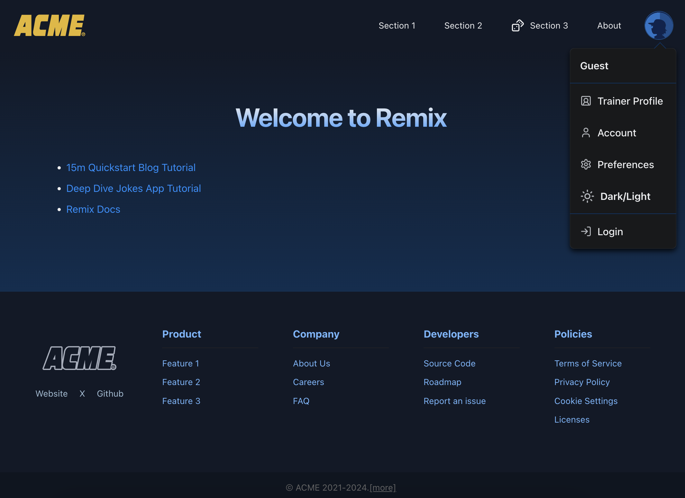

# Welcome to Remix + Vite + Park UI!

Template repository for Remix + Vite + Ark UI + Panda CSS projects.

📖 See the [Remix docs](https://remix.run/docs), the [Remix Vite docs](https://remix.run/docs/en/main/future/vite),
and the [Park UI docs](https://park-ui.com/docs/panda/overview/introduction) for details on supported features.

## What's included

- Customizable Park UI components, built on top of Ark UI, Zag and Panda CSS
- Themable UI components, with multiple color schemes based on Radix UI colors.
- A base responsive layout supporting dark and light themes
- Page transitions with `framer-motion`



## Development

Run the Vite dev server:

```shellscript
npm run dev
```

## Deployment

First, build your app for production:

```sh
npm run build
```

Then run the app in production mode:

```sh
npm start
```

Now you'll need to pick a host to deploy it to.

### DIY

If you're familiar with deploying Node applications, the built-in Remix app server is production-ready.

Make sure to deploy the output of `npm run build`

- `build/server`
- `build/client`
